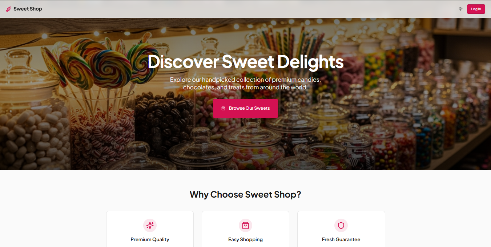

# 🍬 Sweet Shop Management System

A full-stack **Sweet Shop Management System** built as part of a TDD-based kata to demonstrate backend API design, frontend development, authentication, database integration, and responsible AI-assisted development.

🔗 **Live Demo**: [https://25416408-79a3-4a56-98b0-bb9e85ebe53b-00-ylafudixkdgs.riker.replit.dev/](https://25416408-79a3-4a56-98b0-bb9e85ebe53b-00-ylafudixkdgs.riker.replit.dev/)

---

## 📌 Project Overview

This application allows users to browse, search, purchase, and manage sweets in an online sweet shop. It supports **role-based access** (User/Admin), secure authentication, inventory tracking, and a modern frontend interface.

The project follows **Test-Driven Development (TDD)** and clean coding practices, with transparency in AI usage.

---

## ✨ Features

### 👤 Authentication

* User registration and login
* JWT-based authentication
* Protected routes for authenticated users
* Admin-only actions

### 🍭 Sweets Management

* View all available sweets
* Search sweets by name, category, or price range
* Add new sweets (Admin)
* Update sweet details (Admin)
* Delete sweets (Admin)

### 📦 Inventory Management

* Purchase sweets (reduces quantity)
* Restock sweets (Admin only)
* Purchase button disabled when stock is zero

### 🎨 Frontend

* Single Page Application (SPA)
* Responsive and clean UI
* Dashboard view of sweets
* Search and filter functionality

---

## 🛠️ Tech Stack

### Backend

* **Framework**: 

  * Node.js (Express / NestJS)
* **Database**: MongoDB 
* **Authentication**: JWT
* **Testing**: JUnit 

### Frontend

* **Framework**: React 
* **Styling**: CSS 
* **API Communication**: Axios 

---

## 📡 API Endpoints

### Auth

```http
POST /api/auth/register
POST /api/auth/login
```

### Sweets (Protected)

```http
POST   /api/sweets
GET    /api/sweets
GET    /api/sweets/search
PUT    /api/sweets/:id
DELETE /api/sweets/:id   (Admin)
```

### Inventory (Protected)

```http
POST /api/sweets/:id/purchase
POST /api/sweets/:id/restock   (Admin)
```

---

## 🧪 Testing

* Test-Driven Development followed
* Red → Green → Refactor cycle
* High test coverage for backend logic
* Unit and integration tests included

---

## 🚀 Setup & Run Locally

### Backend

```bash
git clone <repository-url>
cd backend
npm install  # or pip install -r requirements.txt
npm run dev  # or equivalent
```

### Frontend

```bash
cd frontend
npm install
npm start
```

---

## 📷 Screenshots

* Login / Register page


* Dashboard


* Sweet listing


* Admin panel


---

## 🤖 My AI Usage

AI tools were used responsibly to **enhance productivity**, not replace understanding.

### Tools Used

* ChatGPT
* GitHub Copilot 

### How AI Was Used

* Brainstorming API structure and database schema
* Generating boilerplate code for controllers and services
* Writing and improving unit tests
* Debugging errors and edge cases
* Improving README documentation

### Reflection

AI significantly reduced development time and helped maintain best practices, but all logic was reviewed, customized, and tested manually to ensure correctness and originality.

---

## 📦 Deployment

The application is currently deployed on **Replit** for **demonstration, evaluation, and interview review purposes**.

Replit enables rapid full-stack deployment with a publicly accessible URL, making it suitable for showcasing functionality, API integration, and end-to-end workflows during assessments and demos.

🔗 **Live Demo**: [https://25416408-79a3-4a56-98b0-bb9e85ebe53b-00-ylafudixkdgs.riker.replit.dev/](https://25416408-79a3-4a56-98b0-bb9e85ebe53b-00-ylafudixkdgs.riker.replit.dev/)

> ⚠️ Note: Replit is used here as a **development and demo hosting platform**, not as a production-grade deployment environment. For real-world production use, the application can be migrated to platforms such as **Vercel/Netlify (Frontend)** and **Render/Railway/AWS (Backend)** with a managed cloud database.

---

## 📄 License

This project is for educational and evaluation purposes.

---

## 🙌 Author

**Nitish Goyal**
Computer Engineering | Full Stack Development | TDD Practitioner

---

⭐ If you like this project, consider giving it a star!


